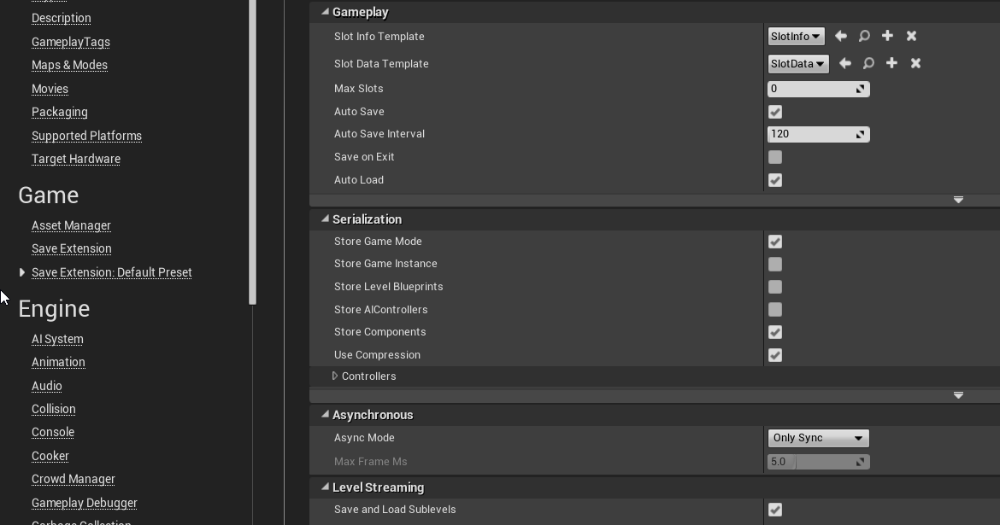

# Presets

**A preset is an asset that serves as a configuration preset for Save Extension.**

Within other settings, presets define how the world is saved, what is saved and what is not.

### Default Preset

Under *Project Settings* -> *Game* -> *Save Extension: Default Preset* you will find the default values for all presets.

This default settings page is useful in case you have many presets, or in case you have none (because without any preset, default is used).

 All settings have defined tooltips describing what they are used for 

#### Gameplay

Defines the runtime behavior of the plugin. Slot templates,  maximum numbered slots, autosave, autoload, etc. Debug settings are inside Gameplay as well.

[Check Saving & Loading](saving&loading.md)

#### Serialization

What should be stored and what should not. Here you can decide if you want to store for example AI. 

You can also enable compression to reduce drastically 

#### Asynchronous

Should load be asynchronous? Should save be asynchronous?

[Check Asynchronous](asynchronous.md)

#### Level Streaming

Should sublevels be saved and loaded individually?

Sublevels will be loaded and saved when they get shown or loaded.

[Check Level Streaming](level-streaming.md)

### Multiple presets

Because presets are assets, the active preset can be switched in runtime allowing different saving setups for different maps or gamemodes.

#### Creating a Preset

You can create a new preset by right-clicking on the content browser -> *Save Extension* -> *Preset*

#### Setting the active Preset

You can set the active preset in editor inside *Project Settings* -> *Game* -> *Save Extension* 

